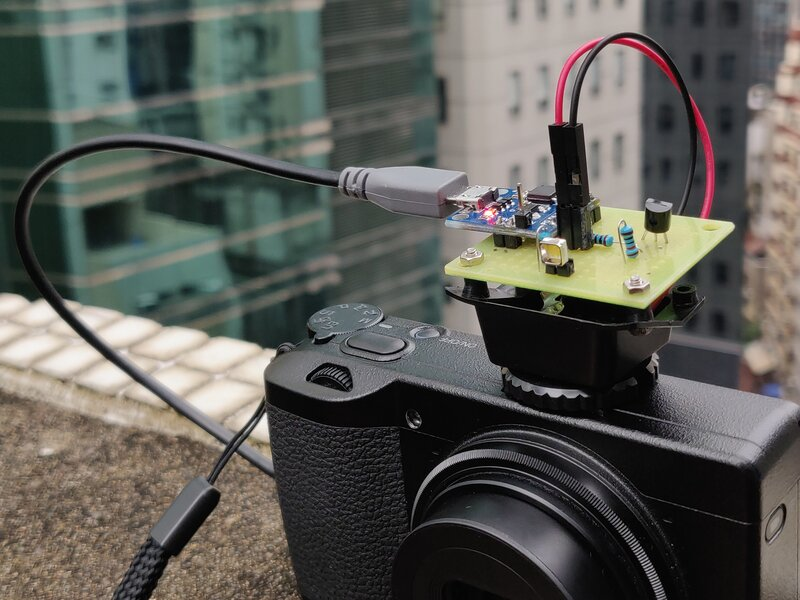

This is a simple LED flash compatible with the hot shoe in a regular
camera. Here it is mounted on a Ricoh GRⅢ, drawing power from its USB
port. The LED used is one for phone cameras. I found it on Taobao.

Limitations:

  * The first image out of a burst is darker. This is either because
    the circuit is not fast enough, or because the LED takes a moment
    to reach full power.

  * It is nowhere as bright as a regular camera flash, but could be
    sufficient for close subjects, e.g. when doing a selfie. More
    testing needed. To increase brightness, a [charge pump circuit][1]
    can be considered.
    
Parts:

  * LED flash for phone cameras: [超聚光白光4.0*4.0*2.1 手机补光灯LED闪光灯珠SMD柔光小角度][2]
  
  * Hot shoe mount taken from a [Yinyan CY-20][3] flash
  
  * Digispark ATtiny85 board with Micro-USB port

  * 2n7000, a few resistors, and other basic electronics parts to
    switch on the LED when the camera triggers the flash (center pin
    is grounded to the rail in the hot shoe)
    

  
The firmware is Arduino compatible.

License
=======

Except where noted otherwise, files are licensed under the WTFPL.

Copyright © 2020 [Felix E. Klee](felix.klee@inka.de)

This work is free. You can redistribute it and/or modify it under the terms of
the Do What The Fuck You Want To Public License, Version 2, as published by Sam
Hocevar. See the COPYING file for more details.

[1]: https://en.wikipedia.org/wiki/File:Wiko_Rainbow_4G_-_Flash_LED_with_SGM3140_LED_Driver_-5572.jpg
[2]: https://item.taobao.com/item.htm?id=578846859616
[3]: https://item.taobao.com/item.htm?id=42439354446
